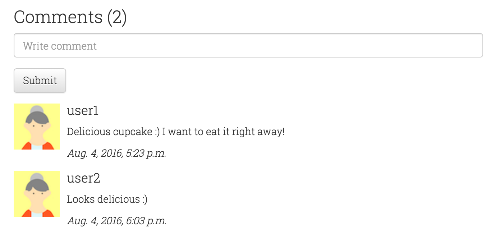

# 심화 (Advance)

## 1. 로그인 및 가입하기 기능 만들기
로그인, 가입하기 기능은 꼭 필요한 기능입니다. 장고는 기본적으로 [user authentication system](https://docs.djangoproject.com/en/1.9/topics/auth/)이 있어요. 또 커스터마이징할 수 있어요! 우리 웹사이트에 로그인과 가입하기 기능을 넣어봅시다.

이를 위해 `accounts`이라는 새 앱을 만듭시다.

```bash
$ python manage.py startapp accounts
```
그리고 이 앱에 앞으로 로그인과 가입하기에 필요한 모든 것들을 넣을 거에요. `INSTALLED_APPS` (settings.py)에 `accounts`를 추가하세요.

이미 슈퍼유저가 생성이 되어 있기 때문에 바로 로그인 기능이 잘 구현되었는지 테스트할 수 있습니다.

그리고 `url`을 수정해야하는데, 아래처럼 `accounts.url`에 모든 `auth`관련 링크가 다 연결되도록 해주세요.


`djangocupcakeshop/urls.py`

```python

url(r'^accounts/', include('accounts.urls', namespace="accounts")),
```

`accounts` 디렉터리에 `urls.py`을 생성하고 아래처럼 코드를 수정해주세요.

```python
from django.conf.urls import include, url
from . import views

urlpatterns = [
    url('^', include('django.contrib.auth.urls')),
]

```
아래 URL패턴을 사용할 수 있어요.

```bash
^login/$ [name='login']
^logout/$ [name='logout']
^password_change/$ [name='password_change']
^password_change/done/$ [name='password_change_done']
^password_reset/$ [name='password_reset']
^password_reset/done/$ [name='password_reset_done']
^reset/(?P<uidb64>[0-9A-Za-z_\-]+)/(?P<token>[0-9A-Za-z]{1,13}-[0-9A-Za-z]{1,20})/$ [name='password_reset_confirm']
^reset/done/$ [name='password_reset_complete']

```
이제 `로그인, 로그아웃`을 만들어 볼 차례에요. `등록하기`페이지를 만들어야겠죠.

디폴트 로그인 url은 `registration/login.html`템플릿을 꼭 가지고 있어야해요.
이제 `accounts` 디렉터리안에 `registration`이라는 새 디렉터리를 만드세요. 그리고 `registration`디렉터리 안에 `login.html`파일을 만들고 아래 내용을 추가하세요.

```html




  <div class="container">
    <!-- Main component for a primary marketing message or call to action -->
    <div class="jumbotron title text-center" style="height: 150px;">
      <h3 style="color:black;">Welcome back!</h3>
    </div>

  </div> <!-- /container -->

  <div class="container">
    <div class="row">
      <div class="col-xs-12 col-sm-12 col-md-offset-4 col-lg-offset-4 col-md-6 col-lg-6">
        
          <p style="color:red;">Your username and password didn't match. Please try again.</p>
        
        
          
            <p>Your account doesn't have access to this page. To proceed,
              please login with an account that has access.</p>
          
            <p style="color:red;">Please login to see this page.</p>
          
        
        <form class="form-horizontal" method="post" action="">
          
        <div class="form-group">
          <label for="{{ form.username.id_for_label }}" class="col-sm-2 col-md-2 col-lg-2 control-label">Username</label>
          <div class="col-sm-10 col-md-5 col-lg-5">
            <input type="text" class="form-control" id="{{ form.username.id_for_label }}" name="{{ form.username.html_name }}" placeholder="username">
          </div>
        </div>
        <div class="form-group">
          <label for="{{ form.password.id_for_label }}" class="col-sm-2 col-md-2 col-lg-2 control-label">Password</label>
          <div class="col-sm-10 col-md-5 col-lg-5">
            <input type="password" class="form-control" id="{{ form.password.id_for_label }}" name="{{ form.password.html_name }}" placeholder="Password">
          </div>
        </div>
        <input type="hidden" name="next" value="{{ next }}" />
        <div class="form-group">
          <div class="col-sm-offset-2 col-sm-10">
            <button type="submit" class="btn btn-default">Log in</button>
          </div>
        </div>
      </form>
    </div>
    </div>
  </div>


```

서버를 재실행하고 [http://127.0.0.1/accounts/login](http://127.0.0.1/accounts/login)에 접속해보세요. 로그인 후, 에러가 보일 거에요. 왜냐하면 프로필 페이지의 뷰와 템플릿을 만들지 않았기 때문이에요. 이제 `registration`디렉터리 안에 `profile.html`페이지를 만들어 봅시다.

`profile.html`

```html




  <div class="container">
    <div class="jumbotron title text-center" style="height: 150px;">
      <h3 style="color:black;">Hello {{ request.user.username }}!</h3>
    </div>
  </div>

  <div class="container">
    
    <h2 class="text-center">My Cupcakes!</h2>
    <div class="row">
      
      <div class="col-sm-6 col-md-4">
        <div class="thumbnail" style="height:336px;">
          <a href=""></a>
          <div class="caption">
            <h3>{{ cake.name }}</h3>
          </div>
        </div>
      </div>
      
    </div>
    
    <h2 class="text-center">No Cupcakes added yet -:(</h2>
    
  </div>


```

템플에서 확인하실 수 있듯이, 사용자가 컵케익을 선택할 수 있어요. 사용자 계정을 위해 view 함수를 추가해야합니다. `views.py`에서 아래 내용을 추가하세요.

```python
from django.shortcuts import render
from django.contrib.auth.decorators import login_required
from menu.models import Cupcake

@login_required
def user_profile(request):
    my_cakes = Cupcake.objects.filter(writer=request.user)
    context = {'cakes':my_cakes}
    return render(request,"registration/profile.html",context)

```

`base.html`템플릿안에 로그인과 가입하기 링크를 아직 추가하지 않았는데요. 링크를 추가한 `base.html` 코드는 아래와 같을 겁니다.

```html


<!DOCTYPE html>
<html lang="en">
<head>
  <meta charset="utf-8">
  <meta http-equiv="X-UA-Compatible" content="IE=edge">
  <meta name="viewport" content="width=device-width, initial-scale=1">
	<title>Django Cupcake Shop</title>

<link rel="stylesheet" href="https://maxcdn.bootstrapcdn.com/bootstrap/3.3.6/css/bootstrap.min.css">
<!-- Optional theme -->
<link rel="stylesheet" href="https://maxcdn.bootstrapcdn.com/bootstrap/3.3.6/css/bootstrap-theme.min.css">
<link rel="stylesheet" href="">
</head>
<body>
  <!-- Fixed navbar -->
  <nav class="navbar navbar-default navbar-fixed-top">
    <div class="container">
      <div class="navbar-header">
        <button type="button" class="navbar-toggle collapsed" data-toggle="collapse" data-target="#navbar" aria-expanded="false" aria-controls="navbar">
          <span class="sr-only">Toggle navigation</span>
          <span class="icon-bar"></span>
          <span class="icon-bar"></span>
          <span class="icon-bar"></span>
        </button>
        <a class="navbar-brand" href="/">Django Cupcake Shop</a>
      </div>
      <div id="navbar" class="navbar-collapse collapse">
        <ul class="nav navbar-nav navbar-right">
          
          <li><p class="navbar-text">Welcome <a href="/accounts/profile">{{ user.username }}</a></p></li>
           <li><a href=""><span class="glyphicon glyphicon-plus"></span></a></li>
           <a href="" class="btn btn-danger navbar-btn">Logout</a>
           
           <a href="}" class="btn btn-primary navbar-btn">Register</a>
           <a href="" class="btn btn-default navbar-btn">Sign in</a>
           
          <li class="dropdown">
            <a href="#" class="dropdown-toggle" data-toggle="dropdown" role="button" aria-haspopup="true" aria-expanded="false">Sort by <span class="caret"></span></a>
            <ul class="dropdown-menu">
              <li><a href="#">Highest</a></li>
              <li><a href="#">Lowest</a></li>
            </ul>
          </li>
        </ul>
      </div><!--/.nav-collapse -->
    </div>
  </nav>

    
    

  <footer class="footer">
      <div class="container">
        <p class="text-muted">Pycon 2016 Tutorial.</p>
      </div>
    </footer>
  <script src="https://ajax.googleapis.com/ajax/libs/jquery/1.11.3/jquery.min.js"></script>
  <script src="https://maxcdn.bootstrapcdn.com/bootstrap/3.3.6/js/bootstrap.min.js" ></script>
  <script>
  $(function () {
  $('[data-toggle="popover"]').popover()
  })
  </script>
</body>
</html>


```

개발 서버를 재 실행하고 로그인이 잘 작동되는지 테스트해보세요. 다음으로 등록 페이지를 만들어 볼 텐데요. 로그인 기능을 만든 것 보다 좀 더 많은 작업을 해야합니다. 가장 먼저 `profile.html`과 `login.html` 파일이 있는 같은 폴더 내에 `register.html`을 생성하세요.

`register.html`

```html




  <div class="container">
    <!-- Main component for a primary marketing message or call to action -->
    <div class="jumbotron title text-center" style="height: 150px;">
      <h3 style="color:black;">Cupcake and High Fives!</h3>
    </div>

  </div> <!-- /container -->

  <div class="container">
    <div class="row">
      <div class="col-xs-12 col-sm-12 col-md-offset-3 col-lg-offset-3 col-md-6 col-lg-6">
        
          <p style="color:red;">Try again.</p>
        
        <form class="form-horizontal" method="post" action="">
          
        <div class="form-group">
          <label for="{{ form.username.id_for_label }}" class="col-sm-4 col-md-4 col-lg-4 control-label">Username</label>
          <div class="col-sm-10 col-md-5 col-lg-5">
            <input type="text" class="form-control" id="{{ form.username.id_for_label }}" name="{{ form.username.html_name }}" placeholder="username">
              {{ form.username.errors }}
          </div>
        </div>
        <div class="form-group">
          <label for="{{ form.password1.id_for_label }}" class="col-sm-4 col-md-4 col-lg-4 control-label">Password</label>
          <div class="col-sm-10 col-md-5 col-lg-5">
            <input type="password" class="form-control" id="{{ form.password1.id_for_label }}" name="{{ form.password1.html_name }}" placeholder="Password">
              {{ form.password1.errors }}
          </div>
        </div>
        <div class="form-group">
          <label for="{{ form.password2.id_for_label }}" class="col-sm-2 col-md-4 col-lg-4 control-label">Confirm Password</label>
          <div class="col-sm-10 col-md-5 col-lg-5">
            <input type="password" class="form-control" id="{{ form.password2.id_for_label }}" name="{{ form.password2.html_name }}" placeholder="Password">
              {{ form.password2.errors }}
          </div>
        </div>
        <input type="hidden" name="next" value="{{ next }}" />
        <div class="form-group">
          <div class="col-md-offset-4 col-lg-offset-4 col-sm-offset-2 col-sm-10">
            <button type="submit" class="btn btn-default">Register</button>
          </div>
        </div>
      </form>
    </div>
    </div>
  </div>



```

`base.html`템플릿에 등록하기 페이지 링크를 추가하세요.

```html
<a href="" class="btn btn-primary navbar-btn">Register</a>
```

두 번째로, 뷰에 `register`함수를 만들어 get/post 요청을 등록하도록 해봅시다.

`accounts/views.py`
import 부터 시작하는 아래 내용을 추가하세요.

```python
from django.http import HttpResponseRedirect
from django.contrib.auth.forms import UserCreationForm
from django.contrib.auth import authenticate,login
```

아래 내용을 이어서 추가하세요.

```python
def register(request):
    if request.user.is_authenticated():
        return HttpResponseRedirect('/accounts/profile')

    if request.method == 'POST':
        form = UserCreationForm(request.POST)
        if form.is_valid():
            new_user = form.save()
            print(new_user.username)
            username = request.POST['username']
            password = request.POST['password1']
            user = authenticate(username=username, password=password)
            if user is not None:
                login(request,user)
                return HttpResponseRedirect('/accounts/profile')
    else:
        form = UserCreationForm()
    return render(request, 'registration/register.html', { 'form': form })

```

> 장고는 기본적으로 유저이름과 비밀번호가 포함된 `UserCreationForm`을 제공합니다. 사용자의 이메일, 성과 이름을 필수값으로 추가하고 싶다면, custom form을 만들어야 합니다.

서버를 재 실행하여 로그인과 등록하기 기능이 잘 작동하는지 확인하세요.

지금 `logout(로그아웃)`링크를 클릭하면 관리자 로그아웃 링크로 연결되는 것을 볼 수 있을 텐데요. 기본값을 수정해 사용자가 로그아웃 이후에 홈페이지로 갈 수 있도록 수정해봅시다.

`accounts/urls.py`에 아래 코드로 수정하세요.

```python
url('^logout/$',views.logout_view,name="logout"),
```

그리고 `accounts/views.py`에 아래 뷰 함수를 추가하세요.

```python
from django.contrib.auth import logout

def logout_view(request):
    logout(request)
    return HttpResponseRedirect('/')
```

서버를 실행해 로그아웃 기능이 잘 작동하는지 확인해보세요.

이제 우리가 생각했던 기능들이 모두 잘 작동하고 있네요! 이제 로그인과 가입하기 페이지가 잘 되는지 테스트해 봐야겠죠?.

`tests.py`

```python

from django.test import TestCase, Client
from django.contrib.auth.models import User

class LoginAndLogout(TestCase):
    def setUp(self):
        self.client = Client()
        u = User.objects.create_user('test_user', 'test@example.com', 'password1')
        u.save()

    def test_login_post(self):
        response = self.client.post("/accounts/login/", {"username": "test_user" ,"password": "password1", "next": "/"}, follow=True)
        self.assertRedirects(response, '/')
        self.assertContains(response, "test_user")

    def test_login_fail(self):
        response = self.client.post("/accounts/login/", {"username": "test_user1" ,"password": "password1", "next": "/"})
        self.assertContains(response, "Your username and password didn't match. Please try again.")

    def test_login_then_logout(self):
        login_response = self.client.post("/accounts/login/", {"username": "test_user" ,"password": "password1", "next": "/"}, follow=True)
        self.assertRedirects(login_response, '/')
        self.assertContains(login_response, "test_user")
        logout_response = self.client.get('/accounts/logout/', follow=True)
        self.assertRedirects(logout_response, '/')
        self.assertNotContains(logout_response, "test_user")

class Register(TestCase):
    def setUp(self):
        self.client = Client()

    def test_register_post(self):
        response = self.client.post("/accounts/register/", {"username": "test_user" ,"password1": "password1",  "password2": "password1"}, follow=True)
        self.assertContains(response, "test_user")
        self.assertEqual(User.objects.get(username="test_user").username, "test_user")

```

아래처럼 테스트 코드를 실행해 볼 수 있어요.

```bash
$ python manage.py test accounts
```
## 2. 댓글 기능 만들기

메뉴에 있는 컵케이크 맛은 어떤지 궁금하지 않나요? 먹어본 다른 사용자들의 리뷰 궁금하죠? 댓글 기능을 추가해 다른 사용자가 리뷰를 남길 수 있게 해볼 거에요.

#### 댓글 모델 생성하기
컵케이크에 대해 사용자가 간단한 댓글을 남길 수 있게 만들어 봅시다. 나중에 관리자가 댓글을 승인할 수 있도록 만들 수도 있어요 :)

`menu/models.py`파일에 댓글 모델을 만들어 봅시다.

```python
class Comment(models.Model):
    post = models.ForeignKey(Cupcake, related_name='comments')
    writer = models.ForeignKey(User)
    text = models.TextField()
    created_date = models.DateTimeField(default=timezone.now)
    approved_comment = models.BooleanField(default=False)

    def approve(self):
        self.approved_comment = True
        self.save()

    def __str__(self):
        return self.text

```

데이터베이스에 새 테이블을 만들기 위해 아래 명령어를 실행하세요.

```bash
$ python manage.py makemigrations menu

$ $ python manage.py migrate menu
```

#### 관리자에 댓글 모델 만들기

`menu/admin.py`파일을 열어보세요. 이제 우리는 댓글 모델 클래스를 모두 가져와야합니다.

```python
from .models import Cupcake, Comment
```

그리고 아래 내용을 comment 모델에 등록해야합니다.
```python
admin.site.register(Comment)


```

#### 사용자가 댓글을 작성하게 만들기

사용자가 댓글을 작성하게 폼을 만들어봅시다. 이미 앞에서 댓글 모델을 만들었는데요. 이제 작성할 수 있는 CommentForm을 만들어야합니다. `forms.py`파일을 열고 아래 코드를 추가하세요.

> import Comment

```python

class CommentForm(forms.ModelForm):

    class Meta:
        model = Comment
        fields = ('text',)
```

`menu/templates/menu/detail.html` 파일을 열고  `endblock`바로 위에 아래 내용을 추가하세요.

```html

  <div class="row">
      <div class="col-xs-12 col-sm-6 col-md-7 col-lg-7 col-md-offset-3 col-lg-offset-2">
        <h3>Comments ({{ cake.comments.count }})</h3>
        <p></p>
        
        <form method="POST">
          <!-- {{ form.as_p }} -->
          <div class="form-group">
            <input type="text" name="{{ form.text.html_name }}" class="form-control" placeholder="Write comment">
          </div>
          <button type="submit" class="btn btn-default">Submit</button>
        </form>
        
          <p><a href="">Login</a> to post comment</p>
        

        
          
          <div class="media">
            <div class="media-left">
              <a href="#">
                
              </a>
            </div>
            <div class="media-body">
              <h4 class="media-heading">{{ comment.writer }}</h4>
              <p>{{ comment.text|linebreaks }}</p>
              <i>{{ comment.created_date }}</i>
            </div>
          </div>
          
        
          <p>No comments here yet :(</p>
        
      </div>
    </div>
    
    <h2 class="text-center">No Cupcake found :(</h2>
    
  </div>

```

CommentForm을 추가하기 위해 `menu/views.py`파일 내 `cupcake_detail`함수를 수정합니다.
수정한 코드는 아래와 같을 거에요.

```python
from .forms import CommentForm


def cupcake_detail(request,pk):
    cake = get_object_or_404(Cupcake,pk=pk)
    if request.method == "POST":
        form = CommentForm(request.POST)
        if form.is_valid():
            comment = form.save(commit=False)
            comment.post = cake
            comment.writer = request.user
            comment.approved_comment = True
            comment.save()
            return redirect('menu.views.cupcake_detail', pk=cake.pk)
    else:
        form = CommentForm()
    context = {"cake": cake, "form":form}
    return render(request,"menu/detail.html",context)

```

> 위의 코드는 모든 댓글을 승인하도록 만들었습니다.

서버를 실행해, 컵케이크 페이지 내 댓글 기능이 잘 작동하는지 확인해보세요 :)



> Tip :  PythonAnywhere 또는 Azure 배포한다음 댓글 기능을 다시 테스트 해보세요. `migrate`명령어를 사용해야 합니다!

## 3. Travis CI와 Coveralls

코멘트를 커밋하기 전에 테스트를 하고 그 다음에 머지 하세요.

> Thankfully, Continuous Integration can save the day. Continuous Integration, often abbreviated to just CI, is the process of automatically building and running tests whenever a change is committed.

We are going to use Travis-CI which is free for open-source projects. Signup for free account on https://travis-ci.org using your Github account. Sync your github repos and enable TRAVIS-CI for project.


Create a file `.travis.yml` in project root directory. Before adding any contents to file. let's complete the signup process for https://coveralls.io. Once you signedup successfully, you can add Github repo.

>Coveralls is a web service to help you track your code coverage over time, and ensure that all your new code is fully covered.


Add following contents to your `.travis.yml` file.

```bash
language: python
python:
  - '3.5'
branches:
  only:
    - 'advance'
    - 'rest-api'
install:
  - pip install -r requirements.txt
  - pip install coveralls
script:
  - python manage.py test
  - coverage run --source=djangocupcakeshop,menu,accounts manage.py test
notifications:
  email: false
after_success:
  coveralls

```

Make sure to add/change `branches` field. In our case, we are adding advance and rest-api branches only.

Let's add nice badges for showing status of build and coverage in our README. Add markup from Travis and Coveralls to your project's RADME.md. Here is one sample

[](https://travis-ci.org/DjangoGirlsSeoul/djangocupcakeshop)
[](https://coveralls.io/github/DjangoGirlsSeoul/djangocupcakeshop?branch=advance)

Now commit your changes and push to Github. It will automatically initiate a travis-cui build and coverage test. You can find similar reports as below


## 4. Change database to MySQL
You can use other databases like Postgres or MySQL, below is the settings for MySQL.

```python
DATABASES = {
    'default': {
        'ENGINE': 'django.db.backends.mysql',
        'NAME': 'mydatabase',
        'USER': 'mydatabaseuser',
        'PASSWORD': 'mypassword',
        'HOST': '127.0.0.1',
        'PORT': '5432',
    }
}

````
You have to install `mysqlclient` to use it.

## 5. Custom Admin
You can cusotmize the Django admin.  Refer to [official tutorial](https://docs.djangoproject.com/en/1.10/intro/tutorial07/) guide for some examples.
