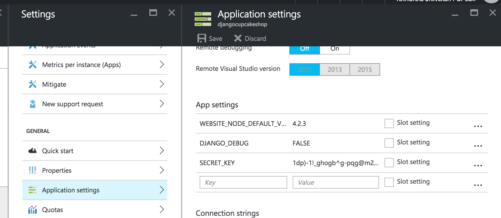

# Azure

> Relevant branch `azure`

Azure는 마이크로 소프트의 클라우드 서버에요. 컵케이크 사이트을 Azure에도 배포할수 있답니다. 무료 계정을 만들어서 Azure를 체험해 보세요. 장고걸스 코치가 Azure에 장고 사이트를 배포 할 수 있도록 친절한 가이드를 이미 준비해놨답니다!

1. English Tutorial : [https://jinpark-dg.gitbooks.io/django-girls-azure/content/](https://jinpark-dg.gitbooks.io/django-girls-azure/content/)

1. Korean Tutorial : [https://github.com/askdjango/azure-webapp-django-setup](https://github.com/askdjango/azure-webapp-django-setup)


#TO-DO (English)
영어로 된 [튜토리얼]([https://jinpark-dg.gitbooks.io/django-girls-azure/content/](https://jinpark-dg.gitbooks.io/django-girls-azure/content/)에서 **Before we start** 부분에 zip file을 다운로드 받는 부분이 있는데요. 조금 바꿔야 할 부분이 있어요! 

### web.config
`web.config`파일에서 `python <add key="DJANGO_SETTINGS_MODULE" value="mysite.settings" />`을 아래와 같이 바꿔주세요!

```python
<add key="DJANGO_SETTINGS_MODULE" value="djangocupcakeshop.settings" />
```

또 이부분을  `<add input="{REQUEST_URI}" pattern="^/static/.*" ignoreCase="true" negate="true" />` 아래와 같이 바꿔주세요!

```python

<add input="{REQUEST_URI}" pattern="^/media/.*" ignoreCase="true" negate="true" />
          </conditions>
```

`requirements.txt` 파일에서 다음과 같은 내용이 있는지 확인해 주세요!

```bash
Django==1.9.8
Pillow==3.0.0

```

## settings.py

`settings.py`파일에서 Azure 사이트를 허용하기 위해 다음과 같이 조금 바꿀꺼에요.

```python

if DEBUG:
    ALLOWED_HOSTS = ['*']
else:
    ALLOWED_HOSTS = ['djangocupcakeshop.azurewebsites.net']
    
```

이제 [튜토리얼]([https://jinpark-dg.gitbooks.io/django-girls-azure/content/](https://jinpark-dg.gitbooks.io/django-girls-azure/content/)로 돌아가서 **Deploying** 스텝을 마무리 해주세요!


### Environment variables
한가지 더 해야 할 것이 있어요! PythonAnywhere에서 했던 것 처럼 `Environment variables`를 추가해야 해요! Azure web app에서 `settings`를 클릭 --> `Application settings`클릭 --> `App settings`--> 그리고 `DJANGO_DEBUG`와 `SECRET_KEY` 값을 넣어주세요! 그리고 저장해 주세요! 



이제 끝 !!!!

Azure에 배포한 djangocupcakeshop 사이트를  탐험해 볼까요!!

[https://djangocupcakeshop.azurewebsites.net/](https://djangocupcakeshop.azurewebsites.net)
