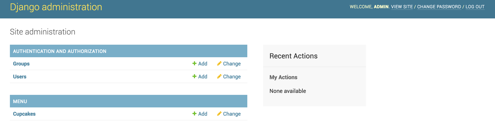
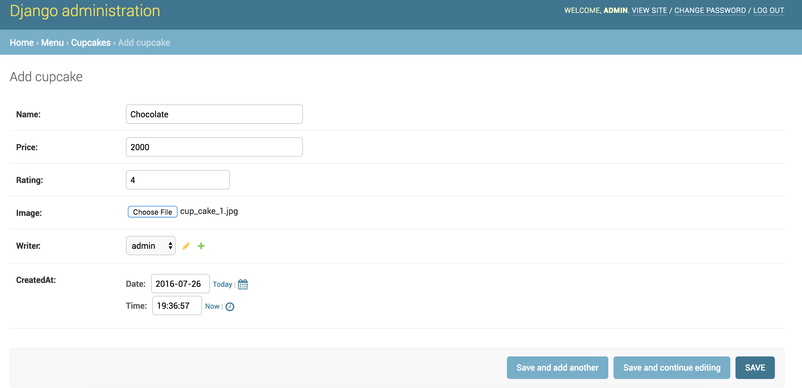

# 데모 1
## Step 1. 설치하기

파이썬 3.5.x, Git, 코드에디터(atom,sublime text, visual code 중 하나)가 반드시 설치되어야 합니다.
프로젝트 시작 전 가상환경을 설치하고 실행시키세요. 그리고 아래 명령어를 입력해 django를 설치합니다.

 ```bash
 $ pip install django
 ```

장고나 다른 패키지를 설치할 때는 `requirements.txt` 파일을 생성해 설치 버전을 저장해 놓는 것이 좋습니다.

 ```bash
 $ pip freeze > requirements.txt
 ```

## Step 2. 프로젝트 시작하기
이제 `djangocupcakeshop` 장고 프로젝트를 시작해봅시다.

 ```bash
 $ django-admin startproject djangocupcakeshop
 ```

## Step 3. 설정 변경하기
프로젝트를 생성하고나서 `settings.py`에 있는 `TIME_ZONE`을 변경해야 합니다. `djangocupcakeshop/djangocupcakeshop/settings.py`에서 `TIME_ZONE`을 찾아 변경하세요. 웹 사이트가 어디서 운영(host)되고 있는지 알려주는 거랍니다. 서울이라면, 아래처럼 변경해주세요.

 ```bash
 $ pip install django
 ```

`STATIC_URL` 부분 아래에 동적파일과 미디어파일(images, css, javascript) 경로도 아래처럼 설정해주세요.

```python
STATIC_ROOT = os.path.join(BASE_DIR, 'static')
MEDIA_ROOT = os.path.join(BASE_DIR, 'media')
MEDIA_URL = '/media/'
```

>MEDIA_ROOT와 MEDIA_URL설정 경로는 이미지와 파일들이 저장되는 경로를 말합니다.

테이터베이스 테이블을 생성했고 브라우저에 프로젝트가 보이는지 확인합시다. 터미널/프롬트프에서 아래 두 명령어를 실행하세요.

``` bash
$ python manage.py migrate

$ python manage.py runserver
```

브라우저를 열고 다음 링크로 접속하세요. : [http://127.0.0.1:8000](http://127.0.0.1:8000)


## Step 4. Django App/Model
> Relevant git branch `model`

a. `menu`앱을 만들고 `settings.py`의 `INSTALLED_APPS`에 새로운 앱을 추가하세요.

```bash
$ manage.py startapp menu
```

`settings.py`

```python
INSTALLED_APPS = (
    'django.contrib.admin',
    'django.contrib.auth',
    'django.contrib.contenttypes',
    'django.contrib.sessions',
    'django.contrib.messages',
    'django.contrib.staticfiles',
    'menu',
)
```

#### Demo. 지금부터 실습을 시작합니다.

b. 메뉴 앱 모델를 생성해봅시다. 여기서부터는 튜토리얼 그대로 따라하세요. `Cupcake`에 필요한 것은 `이름(name), 평가(rating), 가격(price), 이미지(image), 작성자(writer), 작성일(createdAt)`의 정보입니다. 이미지필드(`ImageField`)에서 필요한 것은 `Pillow`패키지가 설치되어야합니다. 아래 명령어를 실행해 설치합시다.

```bash
(myvenv) $ pip install Pillow
```
and then update requirements file by

```bash
(myvenv) $ pip freeze > requirements.txt
```

> 윈도우에서 Pillow가 설치 시 에러가 발생하면, `pip install Pillow==3.0.0`를 사용하세요.

먼저 import 합시다.

```python
from django.contrib.auth.models import User
from django.utils import timezone
```

아래 Cupcake 클래스를 그대로 따라해 봅시다.

```python
class Cupcake(models.Model):
    name = models.CharField(max_length=200)
    price = models.CharField(max_length=20)
    rating = models.FloatField()
    image = models.ImageField(upload_to='images/cakes')
    writer = models.ForeignKey(User)
    createdAt = models.DateTimeField(default=timezone.now)

    def __str__(self):
        return self.name
```

 c. 모델을 생성한 후에, 아래 명령어를 실행해 실제 데이터 베이스를 생성합니다.

 ```bash
 $ python manage.py makemigrations menu
 $ python manage.py migrate
 ```

 > `makemigrations`을 실행하면, 장고에게 모델에 수정할 것이 있는지 확인하라고 말해주는 것입니다. (이 경우에, 새로운 모델이 생성이 되었다는 것을 알려줍니다) 그리고 수정 내용을 migration하게 됩니다.
 >`makemigrations` 이후에 `python manage.py test`을 실행하면 수정한 데이터 베이스가 잘 반영되었는지 테스트할 수 있습니다.
 > `makemigrations` 명령어는 모델의 수정할 내용을 알려주고 `migrate`는 실제로 이를 데이터베이스에 반영하는 것을 말합니다.

## Step 5. Django 관리자
> Relevant git branch `admin`

a. 관리자에 모델을 추가해 관리자 사이트에서 컵케익을 등록할 수 있게 만듭시다. `menu/admin.py`파일을 열고 아래 내용을 추가하세요.

```python
from django.contrib import admin
from .models import Cupcake

admin.site.register(Cupcake)
```

b. 이제 사이트에 컵케이크 메뉴를 더 추가해 봅시다. 이를 하기 위해, 관리자 계정이 필요한데요. 아래 설명을 읽어보면서 명령 프롬프트에 실행합시다.

```bash
python manage.py createsuperuser
```

`python manage.py runserver`명령어를 실행해 서버를 다시 시작해봅시다. [http://127.0.0.1:8000/admin](http://127.0.0.1:8000/admin)에 접속해 로그인하고 컵케이크를 추가하세요!






## Step 6. Django Urls
> Relevant git branch `django-urls`

a. 홈페이지에 url을 추가해야합니다. 먼저, 메뉴 앱에 홈페이지 URL를 추가합시다. `djangocupcakeshop/urls.py` 폴더를 열어 아래 내용을 작성하세요.

```python
urlpatterns = [
    url(r'^admin/', include(admin.site.urls)),
    url(r'', include('menu.urls')),
]
```

b. 다음으로, 아래 `view` 함수에 URL을 추가로 넣을 거에요. `menu`디렉터리안에 `urls.py`새 파일을 만드세요. 그리고 아래 코드를 넣으세요.

```python
from django.conf.urls import url
from . import views

urlpatterns = [
    url(r'^$',views.cupcake_list,name="cupcake_list"),
]
```
이제 서버를 실행해 홈페이지에 접속하면, 에러가 발생할 거에요. 에러 내용을 잘 살펴보면 `cupcake_list` 뷰 함수가 없다는 것을 알게 될 거에요. 다음 번에 뷰 함수를 추가할 거니 걱정하지 마세요.


## Step 7. Django Views
장고에서는 view를 통해 웹 페이지와 콘텐츠를 전달해줍니다. 각각 뷰는 파이썬 함수를 통해 구현되는데요. 장고는 URL을 통해서 특정 view를 선택해 이를 보여줍니다. 앞에서 우리는 홈페이지 `url`을 만들고 이를 보여줬는데요. `menu/views.py`파일에 `cupcakes_list`리스트 함수를 만들 거에요.

```python
from django.shortcuts import render
from . import models

def cupcake_list(request):
    return render(request,"menu/list.html",{})
```

서버를 실행해서 홈페이지로 접속해보세요. [http://127.0.0.1:8000](http://127.0.0.1:8000) 이런! 에러가 발생했네요! 다음 단계에서 이를 찾아봅시다.


## Step 8. Django Templates

a. 앞에서 발생한 에러를 보면, `menu/list.html` 템플릿이 없는 것을 알 수 있을 거에요. 장고 템플릿은 html페이지 인데, 데이터베이스에 저장된 데이터를 사용자에게 보여준답니다. 먼저 `menu`디렉터리에 `templates`폴더를 만드세요. `templates`폴더에서 해당 템플렛을 찾을 거에요. 장고는 여기서 `templates`폴더에서 해당 템플렛을 찾을 거에요. 그 안에 다시 `menu`디렉터리를 만드세요. (`menu/templates/menu`) 이제 `list.html` 파일을 만드세요. (`menu/templates/menu/list.html.`)

우리는 부트스트랩을 사용해 html 페이지를 만들 거에요. [여기](http://getbootstrap.com/getting-started/)에서 부트스트랩 활용 예제들을 확인할 수 있어요. `style.css`파일에서 템플릿을 수정하고 멋있는 이미지들을 추가할 수 있어요! 무료 이미지를 찾고 싶으면 [이 곳](https://www.pexels.com/search/cupcake/)을 이용해보세요. 동적 파일을 추가하려면, `menu`폴더 안에 `static`폴더를 만드세요. 그리고 다시 `menu`폴더를 만드시고요. 이 폴더 안에 css와 이미지 파일들을 넣으면 됩니다. css파일 경로는 `menu/static/menu/css`, 이미지 경로는 `menu/static/menu/images`가 되겠죠.

`list.html`

```html

<!DOCTYPE html>
<html lang="en">
<head>
  <meta charset="utf-8">
  <meta http-equiv="X-UA-Compatible" content="IE=edge">
  <meta name="viewport" content="width=device-width, initial-scale=1">
	<title>Django Cupcake Shop</title>

<link rel="stylesheet" href="https://maxcdn.bootstrapcdn.com/bootstrap/3.3.6/css/bootstrap.min.css">
<!-- Optional theme -->
<link rel="stylesheet" href="https://maxcdn.bootstrapcdn.com/bootstrap/3.3.6/css/bootstrap-theme.min.css">
<link rel="stylesheet" href="">
</head>
<body>
  <!-- Fixed navbar -->
  <nav class="navbar navbar-default navbar-fixed-top">
    <div class="container">
      <div class="navbar-header">
        <button type="button" class="navbar-toggle collapsed" data-toggle="collapse" data-target="#navbar" aria-expanded="false" aria-controls="navbar">
          <span class="sr-only">Toggle navigation</span>
          <span class="icon-bar"></span>
          <span class="icon-bar"></span>
          <span class="icon-bar"></span>
        </button>
        <a class="navbar-brand" href="/">Django Cupcake Shop</a>
      </div>
      <div id="navbar" class="navbar-collapse collapse">
        <ul class="nav navbar-nav navbar-right">
          <li class="dropdown">
            <a href="#" class="dropdown-toggle" data-toggle="dropdown" role="button" aria-haspopup="true" aria-expanded="false">Sort by <span class="caret"></span></a>
            <ul class="dropdown-menu">
              <li><a href="#">Highest</a></li>
              <li><a href="#">Lowest</a></li>
            </ul>
          </li>
        </ul>
      </div><!--/.nav-collapse -->
    </div>
  </nav>


  <div class="container" >

    <!-- Main component for a primary marketing message or call to action -->
    <div class="jumbotron title text-center" style="background-image: url();">
      <h1 class="title">Cupcakes and High Fives!</h1>
      <p>Django Girls Seoul welcomes you!</p>
      <p>Lets build an awesome Django site together</p>
      <p>
        <a class="btn btn-lg btn-primary" href="https://github.com/DjangoGirlsSeoul/djangocupcakeshop" role="button">Source Code &raquo;</a>
      </p>
    </div>

  </div> <!-- /container -->

  <div class="container">
    <h2 class="text-center">Choose your favorite Cupcake!</h2>
    <div class="row">
      <div class="col-xs-12 col-sm-6 col-md-4 col-lg-4">
        <div class="card">
        <div class="card-img-top">
          <div class="image" style="background-image: url();"></div>
        </div>
        <div class="card-block">
          <h4 class="card-title text-center">Chocolate Cupcake</h4>
            <p class="card-text text-center">
              <span class="glyphicon glyphicon-star" aria-hidden="true"></span>
              <span class="glyphicon glyphicon-star" aria-hidden="true"></span>
              <span class="glyphicon glyphicon-star" aria-hidden="true"></span>
              <span class="glyphicon glyphicon-star" aria-hidden="true"></span>
              <span class="glyphicon glyphicon-star" aria-hidden="true"></span>
            </p>
          <a href="#" class="btn btn-default btn-lg btn-block">View</a>
        </div>
        </div>
      </div>
      <div class="col-xs-12 col-sm-6 col-md-4 col-lg-4">
        <div class="card">
          <div class="card-img-top">
          <div class="image" style="background-image: url();"></div>
          </div>
        <div class="card-block">
          <h4 class="card-title text-center">Vanilla Cupcake</h4>
          <p class="card-text text-center">
            <span class="glyphicon glyphicon-star" aria-hidden="true"></span>
            <span class="glyphicon glyphicon-star" aria-hidden="true"></span>
            <span class="glyphicon glyphicon-star" aria-hidden="true"></span>
            <span class="glyphicon glyphicon-star" aria-hidden="true"></span>
          </p>
          <a href="#" class="btn btn-default btn-lg btn-block">View</a>
        </div>
        </div>
      </div>
      <div class="col-xs-12 col-sm-6 col-md-4 col-lg-4">
        <div class="card">
          <div class="card-img-top">
          <div class="image" style="background-image: url();"></div>
          </div>
        <div class="card-block">
          <h4 class="card-title text-center">Blueberry Cookie Cupcake</h4>
          <p class="card-text text-center">
            <span class="glyphicon glyphicon-star" aria-hidden="true"></span>
            <span class="glyphicon glyphicon-star" aria-hidden="true"></span>
            <span class="glyphicon glyphicon-star" aria-hidden="true"></span>
          </p>
          <a href="#" class="btn btn-default btn-lg btn-block">View</a>
        </div>
        </div>
      </div>
    </div>
  </div>

  <footer class="footer">
      <div class="container">
        <p class="text-muted">Pycon 2016 Tutorial.</p>
      </div>
    </footer>
  <script src="https://ajax.googleapis.com/ajax/libs/jquery/1.11.3/jquery.min.js"></script>
  <script src="https://maxcdn.bootstrapcdn.com/bootstrap/3.3.6/js/bootstrap.min.js" ></script>

</body>
</html>

```
We also need a css file for minor adjustments in the template. Create  file `style.css` in `menu/static/menu/css` folder. Add following contents to css file
`style.css`

```css
 @import url(http://fonts.googleapis.com/css?family=Raleway:400,800|Roboto+Slab:300);


body {
  font-family: "Roboto Slab","Helvetica", "Arial", sans-serif;;
  padding-top: 70px;
}

.card {
  margin: 2rem auto;
}
.image {
  width: 100%;
  height: 250px;
  padding-bottom: 50%;
  transition: 0.1s linear;
  background-image: url(http://www.freeallimages.com/wp-content/uploads/2014/09/space-cat-wallpaper-5.jpg);
  background-size: cover;
  background-position: center center;
}

.card-title {
  margin-bottom: 1rem;
  font-weight: 900;
}

.jumbotron {
  height: 450px;
}

.title {
  color: white !important;

}

.footer {
  position: relative;
  bottom: 0;
  width: 100%;
  margin-top: 150px;
  text-align: center;
  /* Set the fixed height of the footer here */
  height: 60px;
  background-color: #f5f5f5;
}
.footer > .container {
  padding-right: 15px;
  padding-left: 15px;
}
.text-muted {
  margin-top: 20px;
}

.glyphicon
{
  color:#FF5252;
}

/* navbar */
.navbar-default {
    border-color: #FF5252;
}

a {
  color: #FF5252;
}


```
`menu/static/images`폴더 안에, 컵케이크 이미지 세 개를 추가하고요. 이미지 파일 이름은 `list.html`파일과 일치해야하니 주의하세요.

b. 이제 컵케이크(`cupcake`)의 가격, 리뷰를 보여주는 상세 페이지를 만들어야 합니다. `list.html`가 있는 동일한 디렉터리에 `detail.html`파일을 만드세요.

```html

<!DOCTYPE html>
<html lang="en">
<head>
  <meta charset="utf-8">
  <meta http-equiv="X-UA-Compatible" content="IE=edge">
  <meta name="viewport" content="width=device-width, initial-scale=1">
	<title>Django Cupcake Shop</title>

<link rel="stylesheet" href="https://maxcdn.bootstrapcdn.com/bootstrap/3.3.6/css/bootstrap.min.css">
<!-- Optional theme -->
<link rel="stylesheet" href="https://maxcdn.bootstrapcdn.com/bootstrap/3.3.6/css/bootstrap-theme.min.css">
<link rel="stylesheet" href="">
</head>
<body>
  <!-- Fixed navbar -->
  <nav class="navbar navbar-default navbar-fixed-top">
    <div class="container">
      <div class="navbar-header">
        <button type="button" class="navbar-toggle collapsed" data-toggle="collapse" data-target="#navbar" aria-expanded="false" aria-controls="navbar">
          <span class="sr-only">Toggle navigation</span>
          <span class="icon-bar"></span>
          <span class="icon-bar"></span>
          <span class="icon-bar"></span>
        </button>
        <a class="navbar-brand" href="/">Django Cupcake Shop</a>
      </div>
      <div id="navbar" class="navbar-collapse collapse">
        <ul class="nav navbar-nav navbar-right">
          <li class="dropdown">
            <a href="#" class="dropdown-toggle" data-toggle="dropdown" role="button" aria-haspopup="true" aria-expanded="false">Sort by <span class="caret"></span></a>
            <ul class="dropdown-menu">
              <li><a href="#">Highest</a></li>
              <li><a href="#">Lowest</a></li>
            </ul>
          </li>
        </ul>
      </div><!--/.nav-collapse -->
    </div>
  </nav>

  <div class="col-xs-12 col-sm-6 col-md-3 col-lg-3">
          <div class="card">
        <ul class="list-group">
          <li class="list-group-item"><span class="glyphicon glyphicon-tag"></span>  <strong>Chocolate Cupcake</strong></li>
          <li class="list-group-item"><span class="glyphicon glyphicon-usd"></span> 3.00</li>
          <li class="list-group-item"><span class="glyphicon glyphicon-pencil"></span> John</li>
          <li class="list-group-item"><span class="glyphicon glyphicon-calendar"></span> 3rd June, 2015</li>
          <li class="list-group-item">
            <span class="glyphicon glyphicon-star"></span>
            <span class="glyphicon glyphicon-star"></span>
            <span class="glyphicon glyphicon-star"></span>
            <span class="glyphicon glyphicon-star"></span>
            <span class="glyphicon glyphicon-star"></span>
          </li>
          <li class="list-group-item">
            <button type="button" class="btn btn-primary" data-toggle="modal" data-target="#myModal">
              Order
            </button>
             </li>
        </ul>
      </div>
    </div>
    </div>
  </div>
  <!-- Modal -->
<div class="modal fade" id="myModal" tabindex="-1" role="dialog" aria-labelledby="myModalLabel">
  <div class="modal-dialog" role="document">
    <div class="modal-content">
      <div class="modal-header">
        <button type="button" class="close" data-dismiss="modal" aria-label="Close"><span aria-hidden="true">&times;</span></button>
        <h4 class="modal-title" id="myModalLabel">Chocolate Cupcake</h4>
      </div>
      <div class="modal-body">
        Complete this website to get your Cupcake!
      </div>
      <div class="modal-footer">
        <button type="button" class="btn btn-default" data-dismiss="modal">Close</button>
      </div>
    </div>
  </div>
</div>
  <footer class="footer">
      <div class="container">
        <p class="text-muted">Pycon 2016 Tutorial.</p>
      </div>
    </footer>
  <script src="https://ajax.googleapis.com/ajax/libs/jquery/1.11.3/jquery.min.js"></script>
  <script src="https://maxcdn.bootstrapcdn.com/bootstrap/3.3.6/js/bootstrap.min.js" ></script>

</body>
</html>

```

C. `list.html`와 `base.html`파일을 보면 헤더와 푸터에 동일한 내용이 있는 것을 알 수있는데요. 장고는 `base`템플릿을 만들어 다른 템플릿에서도 활용될 수 있게 해준 답니다. `list.html`에 있는 폴더에 `base.html` 만들고요. `list.html`내용을 복사하고 수정할 거에요.`<div class="container">`부터 `footer` 전까지 내용을 삭제하고 아래 블록을 추가하세요.

```python
  
    
```

그러면 `base.html`템플릿이 아래와 같을 겁니다.

```html


<!DOCTYPE html>
<html lang="en">
<head>
  <meta charset="utf-8">
  <meta http-equiv="X-UA-Compatible" content="IE=edge">
  <meta name="viewport" content="width=device-width, initial-scale=1">
	<title>Django Cupcake Shop</title>

<link rel="stylesheet" href="https://maxcdn.bootstrapcdn.com/bootstrap/3.3.6/css/bootstrap.min.css">
<!-- Optional theme -->
<link rel="stylesheet" href="https://maxcdn.bootstrapcdn.com/bootstrap/3.3.6/css/bootstrap-theme.min.css">
<link rel="stylesheet" href="">
</head>
<body>
  <!-- Fixed navbar -->
  <nav class="navbar navbar-default navbar-fixed-top">
    <div class="container">
      <div class="navbar-header">
        <button type="button" class="navbar-toggle collapsed" data-toggle="collapse" data-target="#navbar" aria-expanded="false" aria-controls="navbar">
          <span class="sr-only">Toggle navigation</span>
          <span class="icon-bar"></span>
          <span class="icon-bar"></span>
          <span class="icon-bar"></span>
        </button>
        <a class="navbar-brand" href="/">Django Cupcake Shop</a>
      </div>
      <div id="navbar" class="navbar-collapse collapse">
        <ul class="nav navbar-nav navbar-right">
          <li class="dropdown">
            <a href="#" class="dropdown-toggle" data-toggle="dropdown" role="button" aria-haspopup="true" aria-expanded="false">Sort by <span class="caret"></span></a>
            <ul class="dropdown-menu">
              <li><a href="#">Highest</a></li>
              <li><a href="#">Lowest</a></li>
            </ul>
          </li>
        </ul>
      </div><!--/.nav-collapse -->
    </div>
  </nav>

    
    

  <footer class="footer">
      <div class="container">
        <p class="text-muted">Pycon 2016 Tutorial.</p>
      </div>
    </footer>
  <script src="https://ajax.googleapis.com/ajax/libs/jquery/1.11.3/jquery.min.js"></script>
  <script src="https://maxcdn.bootstrapcdn.com/bootstrap/3.3.6/js/bootstrap.min.js" ></script>
</body>
</html>


```

이제 리스트 템플릿과 와 상세 페이지 템플릿이 서로 연결되게 해야합니다.

``` list.html ```

```html




  <div class="container">
    <!-- Main component for a primary marketing message or call to action -->
    <div class="jumbotron title text-center" style="background-image: url();">
      <h1 class="title">Cupcakes and High Fives!</h1>
      <p>Django Girls Seoul welcomes you!</p>
      <p>Lets build an awesome Django site together</p>
      <p>
        <a class="btn btn-lg btn-primary" href="https://github.com/DjangoGirlsSeoul/djangocupcakeshop" role="button">Source Code &raquo;</a>
      </p>
    </div>

  </div> <!-- /container -->

  <div class="container">
    <h2 class="text-center">Choose your favorite Cupcake!</h2>
    <div class="row">
      <div class="col-xs-12 col-sm-6 col-md-4 col-lg-4">
        <div class="card">
        <div class="card-img-top">
          <div class="image" style="background-image: url();"></div>
        </div>
        <div class="card-block">
          <h4 class="card-title text-center">Chocolate Cupcake</h4>
            <p class="card-text text-center">
              <span class="glyphicon glyphicon-star" aria-hidden="true"></span>
              <span class="glyphicon glyphicon-star" aria-hidden="true"></span>
              <span class="glyphicon glyphicon-star" aria-hidden="true"></span>
              <span class="glyphicon glyphicon-star" aria-hidden="true"></span>
              <span class="glyphicon glyphicon-star" aria-hidden="true"></span>
            </p>
          <a href="#" class="btn btn-default btn-lg btn-block">View</a>
        </div>
        </div>
      </div>
      <div class="col-xs-12 col-sm-6 col-md-4 col-lg-4">
        <div class="card">
          <div class="card-img-top">
          <div class="image" style="background-image: url();"></div>
          </div>
        <div class="card-block">
          <h4 class="card-title text-center">Vanilla Cupcake</h4>
          <p class="card-text text-center">
            <span class="glyphicon glyphicon-star" aria-hidden="true"></span>
            <span class="glyphicon glyphicon-star" aria-hidden="true"></span>
            <span class="glyphicon glyphicon-star" aria-hidden="true"></span>
            <span class="glyphicon glyphicon-star" aria-hidden="true"></span>
          </p>
          <a href="#" class="btn btn-default btn-lg btn-block">View</a>
        </div>
        </div>
      </div>
      <div class="col-xs-12 col-sm-6 col-md-4 col-lg-4">
        <div class="card">
          <div class="card-img-top">
          <div class="image" style="background-image: url();"></div>
          </div>
        <div class="card-block">
          <h4 class="card-title text-center">Blueberry Cookie Cupcake</h4>
          <p class="card-text text-center">
            <span class="glyphicon glyphicon-star" aria-hidden="true"></span>
            <span class="glyphicon glyphicon-star" aria-hidden="true"></span>
            <span class="glyphicon glyphicon-star" aria-hidden="true"></span>
          </p>
          <a href="#" class="btn btn-default btn-lg btn-block">View</a>
        </div>
        </div>
      </div>
    </div>
  </div>



```

`detail.html`

```html





  <div class="container">
    <h2 class="text-center">Order Cupcake</h2>
    <div class="row">
      <div class="col-xs-12 col-sm-6 col-md-4 col-lg-4 col-md-offset-2 col-md-lg-2">
        <div class="card">
        <div class="card-img-top">
          <div class="image" style="background-image: url();"></div>
        </div>
        </div>
      </div>
      <div class="col-xs-12 col-sm-6 col-md-3 col-lg-3">
          <div class="card">
        <ul class="list-group">
          <li class="list-group-item"><span class="glyphicon glyphicon-tag"></span>  <strong>Chocolate Cupcake</strong></li>
          <li class="list-group-item"><span class="glyphicon glyphicon-usd"></span> 3.00</li>
          <li class="list-group-item"><span class="glyphicon glyphicon-pencil"></span> John</li>
          <li class="list-group-item"><span class="glyphicon glyphicon-calendar"></span> 3rd June, 2015</li>
          <li class="list-group-item">
            <span class="glyphicon glyphicon-star"></span>
            <span class="glyphicon glyphicon-star"></span>
            <span class="glyphicon glyphicon-star"></span>
            <span class="glyphicon glyphicon-star"></span>
            <span class="glyphicon glyphicon-star"></span>
          </li>
          <li class="list-group-item">
            <button type="button" class="btn btn-primary" data-toggle="modal" data-target="#myModal">
              Order
            </button>
             </li>
        </ul>
      </div>
    </div>
    </div>
  </div>
  <!-- Modal -->
<div class="modal fade" id="myModal" tabindex="-1" role="dialog" aria-labelledby="myModalLabel">
  <div class="modal-dialog" role="document">
    <div class="modal-content">
      <div class="modal-header">
        <button type="button" class="close" data-dismiss="modal" aria-label="Close"><span aria-hidden="true">&times;</span></button>
        <h4 class="modal-title" id="myModalLabel">Chocolate Cupcake</h4>
      </div>
      <div class="modal-body">
        Complete this website to get your Cupcake!
      </div>
      <div class="modal-footer">
        <button type="button" class="btn btn-default" data-dismiss="modal">Close</button>
      </div>
    </div>
  </div>
</div>


```

서버를 실행하고 [http://127.0.0.1:8000](http://127.0.0.1:8000)로 가서 리스트 템플릿을 확인하세요!

**다음 [Demo](demo_part_2.md)**
