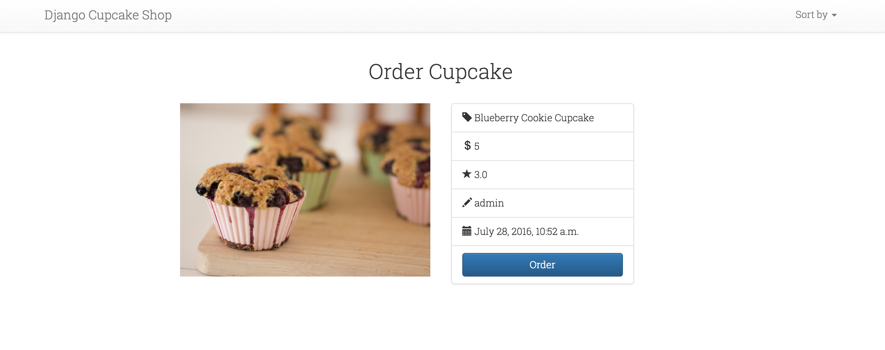
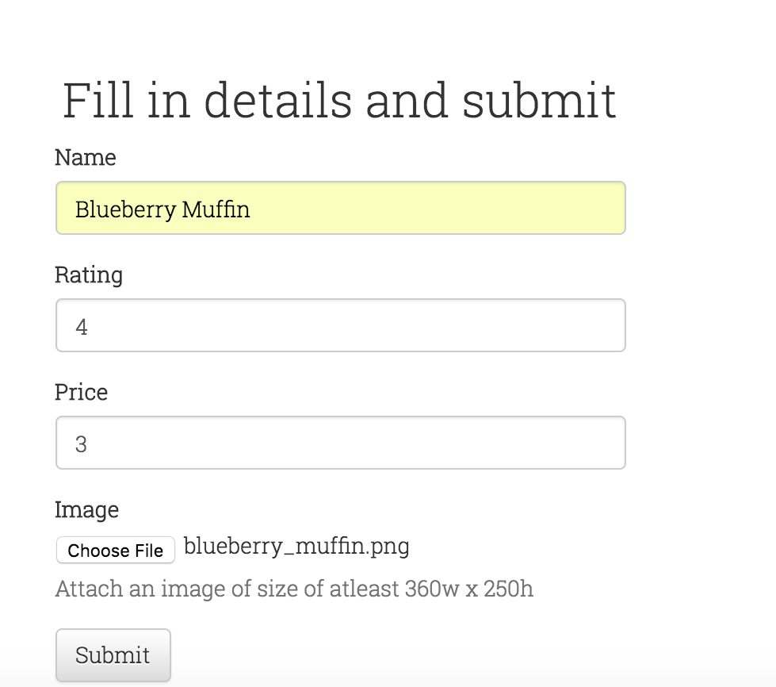
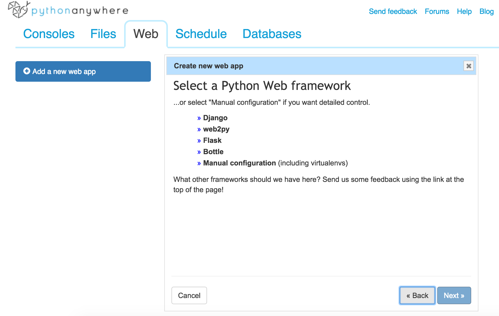
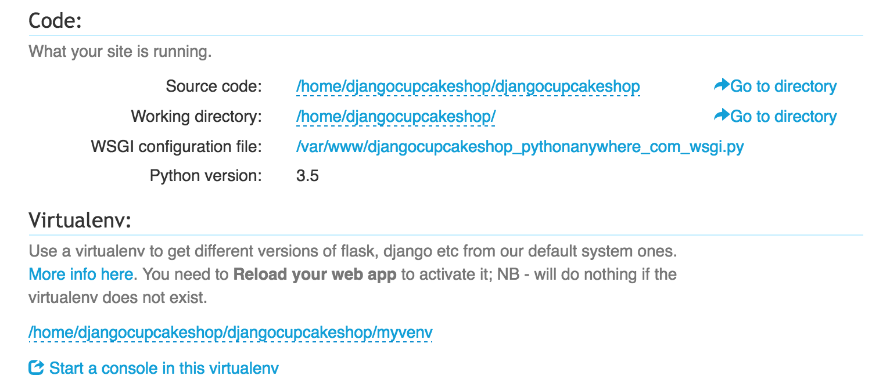
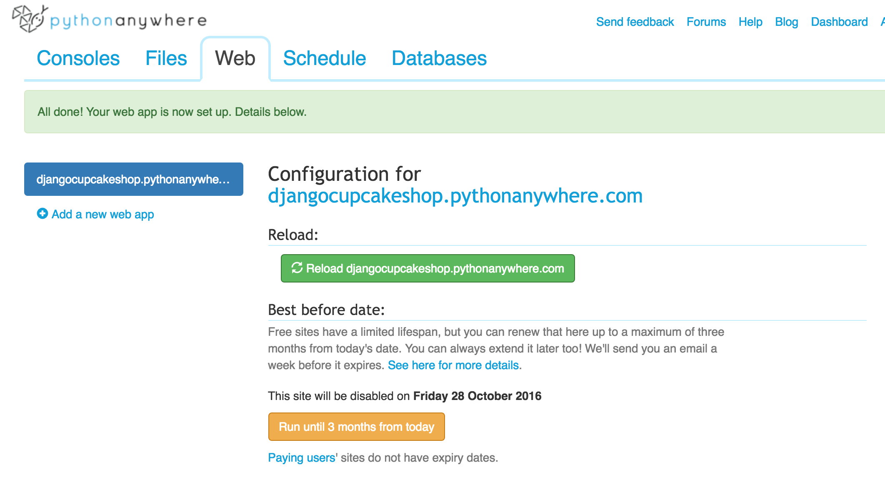

# Demo. Part 2
## Step 9. [템플릿의 동적 데이터](http://tutorial.djangogirls.org/en/dynamic_data_in_templates/#dynamic-data-in-templates)
> `orm` branch 관련 있어요

a. queryset을 이용해서 데이터베이스에 동적데이터(cupcake 정보)를 가져옵니다! `menu/views.py`안에 `cupcake_list` function에 다음과 같은 코드를 추가합니다.

```python
from django.shortcuts import render
from .models import Cupcake

def cupcake_list(request):
    cakes = Cupcake.objects.all().order_by('-createdAt')
    context = {"cakes": cakes}
    return render(request,"menu/list.html",context)

```

위의 `Cupcake.objects.all().order_by('-createdAt')` 부분의 query는 데이터베이스에서 `createdAt`기준으로 내림차순으로 모든 컵케이크 정보들을 가져오는 거에요!

> 이 코드는 `menu/list.html`라는 템플릿에서 로드 되고 context에 전달 될 거에요. `context`는 Python 객체들에 dictionary mapping되는 템플릿 변수 이름입니다.

만약 홈페이지에 방문하면 데이터베이스에서 가져온 데이터들이 템플릿에서 볼수 없을 거에요! 이제 템플릿에서 돌아가서 QuerySet를 보이게 해 볼까요?

b. 템플릿에 queryset으로 가져온 데이터를 추가하기 위해 Django Template Tags를 사용할 거에요. 하드코딩된 컵케이크 코드를 제거 하고 다음과 같이 만들어 보죠!


`list.html`

``` html




  <div class="container">
    <!-- Main component for a primary marketing message or call to action -->
    <div class="jumbotron title text-center" style="background-image: url();">
      <h1 class="title">Cupcakes and High Fives!</h1>
      <p>Django Girls Seoul welcomes you!</p>
      <p>Lets build an awesome Django site together</p>
      <p>
        <a class="btn btn-lg btn-primary" href="https://github.com/DjangoGirlsSeoul/djangocupcakeshop" role="button">Source Code &raquo;</a>
      </p>
    </div>

  </div> <!-- /container -->

  <div class="container">
    
    <h2 class="text-center">Choose your favorite Cupcake!</h2>
    <div class="row">
      
      <div class="col-xs-12 col-sm-6 col-md-4 col-lg-4">
        <div class="card">
        <div class="card-img-top">
          <div class="image" style="background-image: url({{ cake.image.url }});"></div>
        </div>
        <div class="card-block">

          <h4 class="card-title text-center">{{ cake.name }}</h4>
          <p class="card-text text-center">
            <span class="glyphicon glyphicon-star" aria-hidden="true"></span>
          </p>
          <a href="#" class="btn btn-default btn-lg btn-block">View</a>
        </div>
        </div>
      </div>
      
    </div>
    
    <h2 class="text-center">No Cupcakes added yet -:(</h2>
    
  </div>


```
개발 서버를 다시 시작하고 템플릿에 데이터베이스에서 가져온 컵케이크가 잘 보이는지 홈페이지에서 확인해 보세요! :)

c. 일단 여기에 들어가 보면 한가지 문제가 있어요!. 순서를 매기는데 `오직` 별 한개 밖에 안보이는 거죠. Django Template에서는 Template 안에서 `range`같은 복잡한 파이썬 함수들의 사용을 허용하지 않아요. 그래서 우리는 rating count로 looping도 하고 별 갯수도 추가 하기 위해서 커스텀한  Django Template filter를 추가 할 거에요. [여기](https://docs.djangoproject.com/en/1.9/howto/custom-template-tags/)서 `Django Template Filter`에 관한 내용을 확인 할 수 있습니다.

그래서 `models.py` and `views.py` 파일이 있는 폴더에 `templatetags` 폴더를 만들거에요. 그 디렉토리안에 `__init__.py`라는 빈 파일을 추가 해야 된 다는 것을 잊지 마세요!. 그리고 `templatetags` 폴더안에 `menu_extras.py` 라는 파일을 만들어 보아요.

디렉토리 구조는 다음과 같아야 됩니다.

```bash

menu/
    __init__.py
    models.py
    templatetags/
        __init__.py
        menu_extras.py
    views.py

```
`menu_extras.py`안에 다음과 같은 내용을 추가합니다.

```python
from django import template

register = template.Library()

@register.filter
def get_range(value):
    """
     Filter - returns a list containing range made from given value
     Usage (in template):
    """
    return range(int(value))
```
`list.html`에는 ``의 뒷 부분에 다음과 같이 추가 하세요!

```html

```

커스텀한 filter를 이용해서 반복문을 돌리려면 마지막으로 추가해야 되는 게 있습니다. html에 `rating`이라는 부분을 다음과 같이 바꿔주세요.

`list.html`

```html
<p class="card-text text-center">
   
    <span class="glyphicon glyphicon-star" aria-hidden="true"></span>
   
</p>

```


개발 서버를 다시 시작하고 홈페이지에 들어가 데이터베이스에서 가져온 컵케이크들이 잘 보이는지 확인해 보세요! :)

## Step 10 프로그램 어플리케이션 확장하기
> `extend-app` branch와 관련 있어요!

a. 지금까지 `list.html` 템플릿을 적절하게 바꾸는 것을 했는데요. 홈페이지에서 어드민에서 추가한 post들을 볼수 있으면 잘한 거에요! 잘했어요! 이제 사용자들이 버튼을 클릭해서 `Cupcake`에 대한 자세한 정보를 보는 기능을 만들고 싶어요! 기본으로 돌아가서 `list.html` 템플릿을 구성하던 단계를 다시 반복할 거에요.

우선 컵케이크 하나를 가리키는 `url`를 추가하고 `menu/urls.py`파일에 `url(r'^$',views.cupcake_list,name="cupcake_list")` 아래에 `menu/urls.py` 이 부분을 추가해 볼거에요!

```python
url(r'^cupcake/(?P<pk>\d+)/$',views.cupcake_detail,name="cupcake_detail")
```

`^cupcake/(?P<pk>\d+)/$`부분이 어렵게 보이더라도 걱정하지 마세요. 아래 링크에서 자세하게 설명했으니 참고하세요. [[Eng](http://tutorial.djangogirls.org/en/extend_your_application/#create-a-url-to-a-posts-detail), [Kor](https://djangogirlsseoul.gitbooks.io/tutorial/content/extend_your_application/)].

`menu/views.py`에 새로운 함수 `cupcake_detail`를 추가해서 앞에서 만든 `detail` 템플릿을 보여주게 만들 거에요. `cupcake_detail`에서 `cupcake/1`처럼 각 페이지가 숫자로 보이도록 만들 겁니다.

```python
from django.shortcuts import render, get_object_or_404

def cupcake_detail(request,pk):
    cake = get_object_or_404(Cupcake,pk=pk)
    context = {"cake": cake}
    return render(request,"menu/detail.html",context)

```

b. 컵케이크 상세 페이지를 보여주기 전에 두 가지 더 해야할 일이 있어요. 먼저  `list.html`템플릿에 해당 링크를 연결해야하는데요. `<a href="#"...` 부분을 아래 코드로 수정해주세요.

```html
<a href="" class="btn btn-default btn-lg btn-block">View</a>

```

``는  `cupcake_detail` 뷰함수를 가져와 각 상세 페이지를 보여줄 거에요!

두 번째로 `detail.html`에 컵케이크 데이터와 관련된 템플릿 태그와 필터를 만들어 볼 거에요.

```html




  <div class="container">
    
    <h2 class="text-center">Order Cupcake</h2>
    <div class="row">
      <div class="col-xs-12 col-sm-6 col-md-4 col-lg-4 col-md-offset-2 col-md-lg-2">
        <div class="card">
        <div class="card-img-top">
          <div class="image" style="background-image: url({{ cake.image.url }});"></div>
        </div>
        </div>
      </div>
      <div class="col-xs-12 col-sm-6 col-md-3 col-lg-3">
          <div class="card">
        <ul class="list-group">
          <li class="list-group-item"><span class="glyphicon glyphicon-tag"></span>  <strong>Chocolate Cupcake</strong></li>
          <li class="list-group-item"><span class="glyphicon glyphicon-usd"></span> 3.00</li>
          <li class="list-group-item"><span class="glyphicon glyphicon-pencil"></span> John</li>
          <li class="list-group-item"><span class="glyphicon glyphicon-calendar"></span> 3rd June, 2015</li>
          <li class="list-group-item">
            
            <span class="glyphicon glyphicon-star" aria-hidden="true"></span>
            
          </li>
          <li class="list-group-item">
            <button type="button" class="btn btn-primary" data-toggle="modal" data-target="#myModal">
              Order
            </button>
             </li>
        </ul>
      </div>
    </div>
    </div>
    
    <h2 class="text-center">No Cupcake found :(</h2>
    
  </div>
  <!-- Modal -->
<div class="modal fade" id="myModal" tabindex="-1" role="dialog" aria-labelledby="myModalLabel">
  <div class="modal-dialog" role="document">
    <div class="modal-content">
      <div class="modal-header">
        <button type="button" class="close" data-dismiss="modal" aria-label="Close"><span aria-hidden="true">&times;</span></button>
        <h4 class="modal-title" id="myModalLabel">{{ cake.name }}</h4>
      </div>
      <div class="modal-body">
        <p>Order completed 주문 완료됬었습니다!</p>
        <p></p>
        <p>Price : {{ cake.price }}</p>
      </div>
      <div class="modal-footer">
        <button type="button" class="btn btn-default" data-dismiss="modal">Close</button>
      </div>
    </div>
  </div>
</div>


```
개발서버를 재실행하고, 홈페이지에 있는 `view`버튼을 눌러 상세 페이지로 이동해보면 아래처럼 에러가 보일거에요.



a. menu에 템플릿 링크 만들기 그리고 menu 상세 페이지에 뷰 추가하기


## Step. 11 (Django Forms 폼)
> Relevant branch `forms`

이제 마지막으로 해야할 일은 등록한 유저가 새로운 컵케이크를 등록할 수 있게 만드는 겁니다. 장고 어드민이 좋지만, 좀커스터마이징 하기도 어렵고 보기에도 예쁘지 않죠. 폼을 이용해 훨씬 더 멋진 인터페이스를 만들 수 있을 거에요. 여러분이 생각하는 거의 모든 것을 해볼 수 있답니다!

a. `menu`디렉터리 안에 `forms.py`이라는 새 파일을 만드세요. 이미 생성된 모델을 가져와 `ModelForm`에서 활용할 거에요. `forms.py`안에 아래 내용을 추가해주세요.

```python

from django import forms
from .models import Cupcake


class CupcakeForm(forms.ModelForm):

    class Meta:
        model = Cupcake
        fields = ('name','rating','price','image')

```
>`createdAt`와 `writer`은 폼에 활용하지 않을 겁니다.

`menu/urls.py`에 새 url을 추가합시다. `url(r'^cupcake/(?P<pk>\d+)/$',views.cupcake_detail,name="cupcake_detail"),
`다음에 아래 코드를 붙여 넣으세요.

```python
    url(r'^cupcake/new/$', views.cupcake_new, name='cupcake_new'),

```

b. 이제 폼이 만들어 졌으니, url로 전달합시다. 이제 해야할 일은 템플릿을 생성하고 뷰와 연결시키는 것입니다. `base.html`에 있는 네비케이션 버튼 `+`누르면 내용을 작성할 수 있게 할 거에요. 전에 아래 내용을 붙여서 넣으세요. `<li class="dropdown">`.

```html
    
      <li><a href=""><span class="glyphicon glyphicon-plus"></span></a></li>
     
```
>  `user.is_authenticated`은 유저가 로그인한 것을 말합니다. 작성한 내용을 보호하는 기능이 아닙니다.

`menu/templates/menu`디렉터리 안에 `cupcake_new.html`이라는 파일을 추가하세요. 그리고 그 안에 아래 내용을 붙여 넣으세요.

`cupcake_new.html`
```html



  <div class="container">
    <!-- Main component for a primary marketing message or call to action -->
    <div class="jumbotron title text-center" style="height: 200px;">
      <h1 style="color:black;">Add new Cupcake!</h1>
    </div>

  </div> <!-- /container -->

  <div class="container">
    <div class="row">
      <div class="col-xs-12 col-sm-12 col-md-offset-2 col-lg-offset-3 col-md-4 col-lg-4">
        <h2 class="text-center">Fill in details and submit</h2>
      <form method="POST" class="post-form" enctype="multipart/form-data">
          {{ form.non_field_errors }}
          <div class="form-group">
          <label for="{{ form.name.id_for_label }}">Name</label>
          <input type="text" class="form-control" id="{{ form.name.id_for_label }}" name="{{ form.name.html_name }}" placeholder="blueberry Cupcake etc.">
          {{ form.name.errors }}
        </div>
        <div class="form-group">
          <label for="{{ form.rating.id_for_label }}">Rating</label>
          <input type="text" class="form-control" id="{ form.rating.id_for_label }}" name="{{ form.rating.html_name }}" placeholder="1-5">
          {{ form.rating.errors }}
        </div>
        <div class="form-group">
          <label for="{{ form.price.id_for_label }}">Price</label>
          <input type="text" class="form-control" id="{{ form.price.id_for_label }}" name="{{ form.price.html_name }}" placeholder="$ 2.00">
          {{ form.price.errors }}
        </div>
        <div class="form-group">
          <label for="{{ form.image.id_for_label }}">Image</label>
          <input type="file" id="{{ form.image.id_for_label }}" name="{{ form.image.html_name }}">
          <p class="help-block">Attach an image of size of atleast 360w x 250h</p>
          {{ form.image.errors }}
        </div>
        <button type="submit" class="btn btn-default">Submit</button>
      </form>
    </div>
    </div>
  </div>


```
템플릿안에 폼을 추가하는 방법은 아주 간단합니다. 모든 폼을 한번에 반영하고 싶다면 `<form></form>` `{{ form.as_p }}`를 넣으세요.

c. 개발 서버를 실행하면 에러가 보일 거에요. 아직 뷰에 폼 내용을 추가하지 않았기 때문이에요. Open `menu/views.py` 파일을 열고 `from` 줄부터 아래 내용을 추가하세요.

```python
from django.shortcuts import redirect
from .forms import CupcakeForm
from django.utils import timezone
from django.contrib.auth.decorators import login_required

```

그리고 아래와 같이 함수를 만들어 주세요.

```python
@login_required
def cupcake_new(request):
    if request.method == "POST":
        form = CupcakeForm(request.POST,request.FILES)
        if form.is_valid():
            cake = form.save(commit=False)
            cake.createdAt = timezone.now()
            cake.writer = request.user
            cake.save()
            return redirect('cupcake_detail',pk=cake.pk)
    else:
        form = CupcakeForm()
    context = {'form':form}
    return render(request,"menu/cupcake_new.html",context)
```

> `@login_required`는 로그인을 한 유저만 새로운 컵케익 내용을 작성할 수 잇게 만드는 것입니다.

이제 잘 작동하는지 확인해봅시다. [http://127.0.0.1:8000/cupcake/new/](http://127.0.0.1:8000/cupcake/new/) 페이지로 이동해서, 이름, 평가, 가격, 이미지를 작성하고 제출하세요! 새로운 컵케익이 추가되었고 `cupcake_detail`페이지로 이동하는 것을 볼 수 있어요!



잘했습니다! :) 이제 사이트 배포만 하면 됩니다!

이제 해야할 것이 하나 더 남았습니다. 다음 단계로 넘어갑시다.

## Step 12. PythonAnywhere [배포하기](http://tutorial.djangogirls.org/ko/deploy/#github에서-pythonanywhere로-코드-가져오기)

> Relevant branch `deploy`

잘했어요! 이제 거의 다 끝나갑니다! PythonAnywhere로 배포 전에 해야할 게 있습니다. `Github`에 변경된 내용을 모두 커밋하고 푸쉬하세요.
`.gitignore`파일 내용이 아래와 같아야 합니다.

```bash
*.pyc
__pycache__
myvenv
db.sqlite3
/static
.DS_Store
media/
```
### 배포시 보안 확인하기
> Follow this [link](https://github.com/espern/espern.github.io-source/blob/master/content/home/en-securing-your-django-settings-on-github.md)

#### Django 비밀키
`settings.py` 파일을 열면 비밀키(`secret key`)를 확인할 수 있어요.

```python
# SECURITY WARNING: keep the secret key used in production secret!
SECRET_KEY = '(+73cf=j*8!=r$#2à^@ibgpw8yn9pm#wa42bk&amp;v(@*%m7nx1sg'
```
깃헙에 소스를 저장하기 때문에 모든 사람들이 비밀키를 확인할 수 있어요. 다른 사람들이 비밀키를 알지 못하게 하려면 개발과 배포 서버에 `settings.py`를 따로 적용하면 됩니다. 비밀키 설정은 조금 까다로워요.

 PythonAnywhere에 환경변수(`Environment Variables`)를 사용해 `database password`와 `SECRET_KEY`를 설정할 겁니다. 이전에  `settings.py`파일에 있는 `secret_key`를 임의로 변경해주세요. 배포 버전에서 `DEBUG=False`를 적용할 거고요. 아래처럼 `DEBUG=True`, `SECRET_KEY`, `ALLOWED_HOSTS` 내용을 수정해주세요.

```python
DEBUG = os.getenv('DJANGO_DEBUG') != 'FALSE'

# SECURITY WARNING: keep the secret key used in production secret!
if DEBUG:
    SECRET_KEY = 'Hell@World!'
else:
    SECRET_KEY = os.getenv('SECRET_KEY')

# SECURITY WARNING: don't run with debug turned on in production!

if DEBUG:
    ALLOWED_HOSTS = ['*']
else:
    ALLOWED_HOSTS = ['djangocupcakeshop.pythonanywhere.com']

```

`os.getenv('DJANGO_DEBUG')`은  PythonAnywhere에서 사용할 환경 변수에요.

> Github에 실제 비밀키가 배포되어서는 안됩니다. PythonAnywhere에서 `DEBUG=False`이라고 설정할 거에요.

#### Github으로 배포하기

`git status`명령어를 실행해 현재 상태를 확인하세요. 모든 변경된 코드를 저장하려면 아래와 같이 입력하세요.

```bash
$ git add --all
$ git commit -m "finished tutorial until Step 10"
```

이제까지 한 모든 작업 내용을 Github에 올리세요.

```bash
$ git push -u origin master
```

#### PythonAnywhere

PythonAnywhere은 무료계정이 있어 배포시 이를 사용하실 수 있습니다. [PythonAnywhere.com](https://www.pythonanywhere.com)으로 접속해 로그인하세요.
> "Beginner" 계정으로 가입하시면 무료로 사용하실 수 있습니다.

PythonAnywhere로 가시면, 대시보드 또는 "Consoles"페이지로 이동될 겁니다. "Bash" 콘솔을 클릭하세요. -- `bash`는 로컬 컴퓨터에 있는 콘솔과 같은 콘솔이랍니다

`git clone` 명령어를 입력해 Github에 있는 모든 PythonAnywhere로 이동하게 만드세요.

```bash
$ git clone https://github.com/<your_github_user_name>/djangocupcakeshop.git
```

> `<your_github_user_name>`은 github유저 네임입니다. `DjangoGirlsSeoul`이 아니에요 :)

PythonAnywhere에서 환경 변수를 적용할 차례입니다.

```bash
$ cd djangocupcakeshop
$ virtualenv --python=python3.5 myvenv
$ source myvenv/bin/activate
(myvenv) $ pip install -r requirements.txt
```

`.gitignore`폴더에 `db.sqlite3`파일이 있습니다. Github에서는 데이터베이스 내용이 무시되어 저장될 거에요. 그래서 PythonAnywhere에서 새로운 데이터베이스를 생성하고 `superuser`도 다시 만들어야 합니다

```bash
(myvenv) $ python manage.py migrate
(myvenv) $ python manage.py createsuperuser
```

이제 하나 더 해야할 일이 남았습니다. 콘솔로 가서 아래 명령어를 실행해주세요.

```bash
(myvenv) $ python manage.py collectstatic
```

실행되면 `yes`라고 입력하세요. 장고는 모든 동적 파일을 (images,css, javascript) `the STATIC_ROOT`디렉토리로 옮길 겁니다.

이제 콘솔에서 해야할 명령어는 모두 끝났어요.

로고를 클릭해 PythonAnywhere대시보드로 돌아가고, Web 탭을 클릭하세요. 그리고 다시 new web app을 클릭하세요.

도메인 이름이 확정되면, manual configuration ("Django"옵션이 아닙니다)을 선택하세요. Python 3.5을 클릭하고 종료하세요.




#### virtualenv 설정

"Virtualenv" 단계에서,"Enter the path to a virtualenv"를 클릭하고 엔터를 누르세요.  `/home/<your-PythonAnywhere-username>/djangocupcakeshop/myvenv/` 경로를 작성하고 파란색 클릭 버튼을 누르세요.



`/home/<your-PythonAnywhere-username>/djangocupcakeshop` 경로를 작성하고 파란색 클릭 버튼을 누르세요.


#### WSGI file 설정
`wsgi configuration file` 링크를 클릭하고 아래 내용을 붙여 넣으세요.

`wsgi`

```python
import os
import sys

path = '/home/<your_pythonanywhere_username>/djangocupcakeshop'  # use your own PythonAnywhere username here
if path not in sys.path:
    sys.path.append(path)

os.environ['DJANGO_SETTINGS_MODULE'] = 'djanocupcakeshop.settings'
os.environ['DEBUG'] = 'FALSE'
os.environ['SECRET_KEY'] = 'MY_SECRET_KEY'

from django.core.wsgi import get_wsgi_application
from django.contrib.staticfiles.handlers import StaticFilesHandler
application = StaticFilesHandler(get_wsgi_application())
```
> `MY_SECRET_KEY`에 실제 비밀키를 변경해주세요!

잘했습니다! 재실행 버튼을 누ㄹ면 어플리케이션으로 이동할 거에요. 페이지 맨 위쪽에 링크가 있어요.



	a. PythonAnywhere에서 무료 계정인 "초보자(Beginner)"로 회원가입 하세요. GitHub에서 PythonAnywhere로 코드 가져오기
	b. PythonAnywhere에서 가상환경(virtualenv) 생성하기. 콘솔창에서 `virtualenv --python=python3.4 myvenv` 그리고 `pip install -r requirements.txt` 실행하세요. 정적 파일 모으기 `python manage.py collectstatic`
	c. PythonAnywhere에서 데이터베이스 생성하기 `python manage.py migrate`
	d. web app으로 DjangoCupcakeshop 배포하기 - 가상환경(virtualenv) 설정하기 그리고 WSGI 파일 설정하기


## Step 13. Homework (숙제)

a. 가격 순으로 리스트 배열: 최저가격 `highest` 최고가격 `lowest` 순으로 리스트 배열하기

> 도움 : `cupcakes/price/hightolow`처럼 url을 만들고 뷰 함수를 추가해야합니다. 데이터 베이스부터 데이터를 Get the data from Database, convert price `string` to int and sort using python. You can use the same template `list.html` for this homework.

b. 평점 순으로 리스트 배열: 최고 평점 `highest` 순으로 리스트 배열하기
