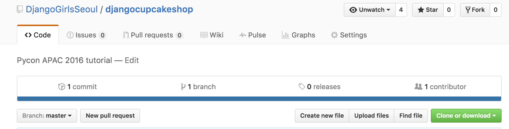
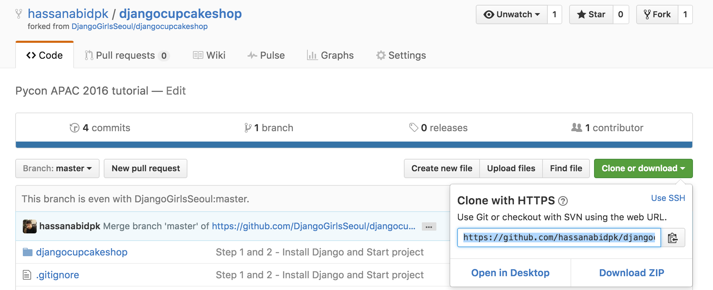

# 시작하기

##이 튜토리얼을 찍고 내 리퍼지토리로 복사하세요.

오른쪽 위에 있는 Fork 버튼을 누릅니다 [[link](https://github.com/djangogirlscodecamp/djangocupcakeshop)]



git clone을 사용하여 여러분의 컴퓨터에 코드를 복사합니다.



```bash 
$ git clone https://github.com/<user_name>/djangocupcakeshop.git

```

  > Note: replace <user_name> with your Github username. It should be the forked repository from step 1. 


Mac/Linux 환경에서는 terminal, window 환경에서는 prompt을 열고 djangocupcakeshop 폴더로 이동합니다.

`cd djangocupcakeshop` 치고 djangocupcakeshop 폴더 안으로 이동합니다.


아래 command를 콘솔에 치고 가상환경을 만듭니다.

#### 윈도우의 경우 
```C:\Python35\python -m venv myvenv``` 
#### 맥의 경우 
```python3 -m venv myvenv ```
리눅스의 경우 : 
```virtualenv --python=python3.4 myvenv```

가상환경을 활성화 시킵니다. 

#### 윈도우의 경우: 
```bash
myvenv\Scripts\activate 
``` 

### 맥이나 리눅스의 경우: 

```bash
$ source myvenv/bin/activate
``` 

터미널 또는 prompt에서 다음과 같이 보이는지 확인합니다.

```bash 
(myvenv)... 
```

아래 명령어를 이용해서 장고를 설치합니다. 


```bash
$ pip install -r requirements.txt
```

`python manage.py migrate` 통해 데이터 베이스를 만듭니다.


[데모를 4(b)](demo.md) 단계 부터 따라합니다.
